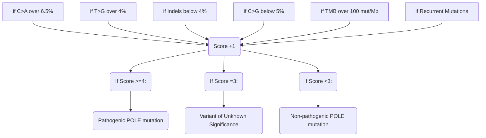

# PathoPoleAnalyzer 

PathoPoleAnalyzer is a tool for calculating a pathogenicity score for Pole mutations.

The score is an integer ranging from 0 to 6, indicating whether the POLE mutation is pathogenic (Score >=4), of uncertain significance (Score = 3), or non-pathogenic (Score<3),based on the presence of specific genomic alterations.

To calculate this score, PathoPoleAnalyzer evaluates several parameters:
- Tumor Mutational Burden (TMB)
- Presence of recurrent Pole mutations
- Frequency of C>A substitutions
- Frequency of C>G substitutions
- Frequency of T>G substitutions
- Frequency of Indels (insertions and deletions)

## Requirements and installation

A list of requirements can be found in `requirements.txt` 

To automatically install PathoPoleAnalyzer, use the following command:

>python3 -m pip install -r /path/to/requirements.txt


## Input Data

PathoPoleAnalyzer requires a VCF file and a TMB value as input.

PathoPoleAnalyzer accepts either a single vcf file or a folder containing multiple vcf files as input.

In the case of a single file, the value of TMB can be passed directly as the value of the ```--TMB``` \ ```--t``` argument. 
If the input is a folder, the value of the ```--TMB``` argument must be a file containing sampleID and the value of TMB. For a template of the file, see ```TMB.txt```

Use the following command to launch PathoPoleAnalyzer:

>$ python3 pathopoleanalyzer.py -i vcfFilePath -t TMBvalue

or

>$ python3 pathopoleanalyzer.py -i vcfFileFolder -t TMB.txt


### Filter vcf
To reduce the time required for the analysis, PathoPoleAnalyzer automatically filter the input vcf file. Filtered vcf are saved in 
```filtered_vcf``` folder.  

### Results
Score results are shown in the log and saved in the file ```Results_pathopoleanalyzer.txt```.


### Customization

Threshold of parameters, path of folder for filtered vcf and of the result file can be customized by editing the config file ```conf.in```.


## What raises the Score?

The thresholds for the different parameters are readjusted compared to Castillo's article and are as follows:

	C>A substitutions > 6.5%, 
	T>G substitutions > 4%, 
	C>G substitutions < 5%, 
	Indels < 4%, 
	TMB > 100 mut/Mb.
	Presence of Recurrent Mutations


<div class="center">

  




## What is defined as a 'Recurrent Mutation'?

According to [over-mentioned Paper](https://pubmed.ncbi.nlm.nih.gov/31829442/)(Table 1 and Table 3) :

	Recurrent mutations were defined as those present in two or more cancer samples in the COSMIC and TCGA databases 
 	combined (cases present in both databases were counted only once). 
  	A mutation was considered non-recurrent if it was found only one.


Below the mutations that are considered recurrent in POLE, along with chromosomal position, nucleotide substitution and protein change:

	CHROM: POS			NUCL. SUB.		PROT. CHANGE
	chr12:133253184		c.857C>G		P286R
	chr12:133250289 	c.1231G>T		V411L
	chr12:133253151		c.890C>T  		S297F
	chr12:133249847		c.1376C>T		S459F
	chr12:133249857		c.1366G>C		A456P
	chr12:133252327		c.1100T>C		F367S
	chr12:133250250		c.1270C>A		L424I
	chr12:133253157		c.884T>G		M295R
	chr12:133250213		c.1307C>G		P436R
	chr12:133250189		c.1331T>A		M444K
	chr12:133252325		c.1102G>T		D368Y
 	chr12:133250250		c.1270C>G		L424V
	chr12:133253208		c.833C>T		T278M
 	chr12:133249829		c.1394C>T		A465V
	chr12:133256623      	c.340C>T		R114*
	chr12:133252023		c.1187A>G		E396G
	chr12:133257828		c.100C>T		R34C


</div>
