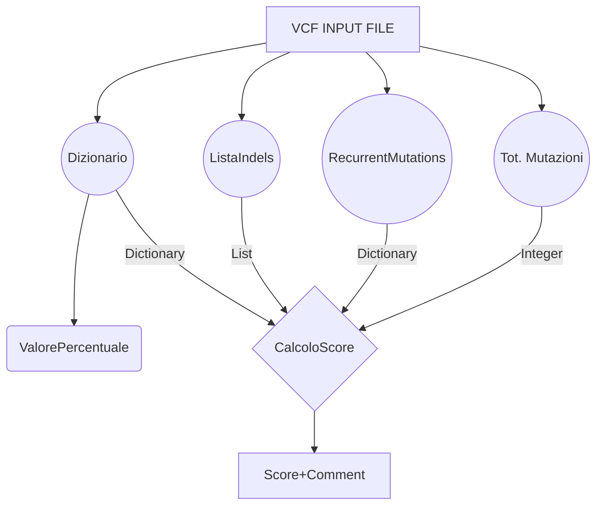
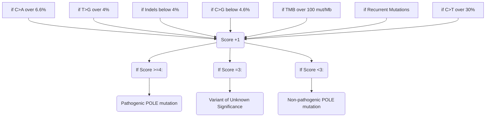

# POLE
Repository for pathogenic estimation of POLE mutations via development of a score

# POLE functions

## The Script

The script overall generates a Dictionary that is composed of the counts of types of mutations found in a filtered VCF file given as input.

After this it generates a score: an integer number whose value depends on the data of the dictionary and returns a specific output depending on the score. This putput is mostly a sentence which suggests if the vcf presents a POLE mutation which is pathogenic (Score >= 4), non-pathogenic (Score < 3) or  a variant of unknown isgnificance (score = 3)
To generate this score are taken into account not only the data of the Dictionary, but also the list Indels (which comprehend the amoun to observes events of insertion and mutation) and the total number of different mutations observed in the VCF file.

The output files of this script are based on the data available on the following article  ["Interpretation of somatic POLE mutations in endometrial carcinoma"](https://pubmed.ncbi.nlm.nih.gov/31829442/). 
(Castillo et. all, 2020)

## Input Files and Requirements
All the functions of the code take a file / folder as an input
The required input files are .vcf
It is suggested to first filter the vcf that needs to be analyzed.
This can easily be done with the [vcf_filter.py]([https://gitlab.com/gstep-bioinformatics-core-facility-research/varan-2.0/-/blob/main/vcf_filter.py](https://github.com/bioinformatics-policlinicogemelli/POLE/blob/main/filter_VCF.py)) script.
Use the following command, which requires a file to input and the preferred path for the output file:
>$ python filter_VCF.py -i "path the the VCF file" -o "name of the output VCF file"

In our script, PyVCF is a required Python package for the analysis of the VCF files. Documentation and available [here](https://pyvcf.readthedocs.io/en/latest/index.html). Installation command available [here](https://pypi.org/project/PyVCF/).
Other package used by the score calculator include [Pandas](https://pypi.org/project/pandas/), [Numpy](https://pypi.org/project/numpy/), and [Matplotlib](https://pypi.org/project/matplotlib/).

## Functions of the Script

In total the Script has 6 functions, shown in the table below:

|FUNZIONE                |INPUT                          |OUTPUT                         |	EXAMPLE OUTPUT
|----------------|-------------------------------|-----------------------------|-----------------------------|
|'dizionario'						|VCF			|A Dictionary with the number of observed events of substitutions. Keys are the types of mutatioons; Values are the number of said mutations observed.			|{'A>C': 0, 'A>G': 13, 'A>T': 2, 'C>A': 1, 'C>G': 1, 'C>T': 8, 'G>A': 14, 'G>C': 0, 'G>T': 2, 'T>A': 1, 'T>C': 8, 'T>G': 0}
|'listaindels'        			|VCF           |List including both insertion and deletion events ("Indels").            |	['[CT]', '[AT]', '[AT]', '[GC]', 'TC', 'CG']
|'recurrentmutations'        			|VCF           |Dictionary  with the "Recurren Mutations" found in the VCF; Dictionary includes chromosome positions as the keys and mutations as the values.            |	 Numero Recurrent Mutations trovate:  2, Recurrent Mutations =  {12345678: 'C>G', 11223344: 'C>A'}
|'eventimutazionetotali'          |VCF			|Total number of mutations, including substitutions, deletions and insertions.| 12345
|'valorepercentuale'          	|VCF				|Percentage frequency of events of mutation compared to the total VCF data for every event of substitution.| A>G mutations = 26.0%; C>T mutations = 3.0 %, ....
||||
|'calcoloscore'          			|Dictionary, TMB, MSI |Analyzing the given data, the function will increase the score (which starts at "0") of +1 each time one of the given conditions are satisfied(ex. percentage of frequency of events 'C>T' greater than 30%). The output is an integer which represents the Score.	Depending on the value of the Score obtained with the function above, a different comment will pop up as an estimation of the type of observed mutation.	| 3, 4 or 5...... example of the message printed: "Pathogenic POLE mutation"
||||
|'dictoplot'          	|VCF				|Percentage frequency of events of mutation in the form of a Bar Plot. Additional Bar Plot analysis relegated to comparison of the mutation betweeen two data (one 'OLD' and one 'NEW'; the 'NEW one given by default')| Bar Plot including mutations events, both substitutions and indels.

## Diagram of the Workflow

UML flow chart available made with [Mermaid](https://mermaidjs.github.io/). 

## Call the Script in the Command Prompt

An ArgParse has been implemented which allows to call the function in the Terminal.
Make sure to enter the folder with both the Python script and your filtered VCF File.
The required input data include the folder where the filtered VCF is positioned and the TMB (Tumor Mutational Burden)

Use the following command to receive the full output of the script:
>$ python POLE_SCORE.py -f "YOUR_filtered_VCF_FILE.vcf" --TMB (value of the TMB)
or
>$ python POLE_SCORE.py -f "YOUR_filtered_VCF_FILE.vcf" -t (value of the TMB)

You can save the result of your analysis in a text file by typing the following command in the Command Prompt:
>$ POLE_SCORE.py -f "YOUR_filtered_VCF_FILE.vcf" > VCF_Results.txt

If you prefer to have an output featuring additional details regarding mutation frequency and the conditions which raised the score, try to run the 'POLE_SCORE(additional_output_details).py' with the same process.

## What raises the Score?

The conditions for which the Score is raised are based on the data available on ["Interpretation of somatic POLE mutations in endometrial carcinoma"](https://pubmed.ncbi.nlm.nih.gov/31829442/)(Castillo et. all, 2020).
Takin into consideration the different size of the exome of the FPG500 input data featured in our study, the threshold the allowed a raise of the score were modified with a conversione via Median of Medians technique-.
Given a filtered VCF file, the requirement to find a POLE mutation are:

	C>A substitutions > 6.6%, 
	T>G substitutions > 4%, 
	C>G substitutions < 4.6%, 
	Indels < 4%, 
	TMB > 100 mut/Mb.
	Presence of Recurrent Mutations

  

## What is defined as a 'Recurrent Mutation'?

The [over-mentioned Paper](https://pubmed.ncbi.nlm.nih.gov/31829442/)(Table 1 and Table 3 of the Paper) takes in consideration whether POLE mutations were recurrent in ECs within the COSMIC or TCGA databases, as recurrent mutations are more likely to be pathogenic.

As mentioned before, if at least one of these next mutations are featured in the analized VCF, the score will rise by +1.

Below the mutations that are considered recurrent in POLE, along wIth chromosomal position, nucloetide substitution and protein change:

	CHROM: POS			NUCL. SUB.		PROT. CHANGE
	chr12:133253184		c.857C>G		P286R
	chr12:133250289 	c.1231G>T		V411L
	chr12:133253151		c.890C>T  		S297F
	chr12:133249847		c.1376C>T		S459F
	chr12:133249857		c.1366G>C		A456P
	chr12:133252327		c.1100T>C		F367S
	chr12:133250250		c.1270C>A		L424I
	chr12:133253157		c.884T>G		M295R
	chr12:133250213		c.1307C>G		P436R
	chr12:133250189		c.1331T>A		M444K
	chr12:133252325		c.1102G>T		D368Y
 	chr12:133250250		c.1270C>G		L424V
	chr12:133253208		c.833C>T		T278M
 	chr12:133249829		c.1394C>T		A465V
	chr12:133256623      	c.340C>T		R114*
	chr12:133252023		c.1187A>G		E396G
	chr12:133257828		c.100C>T		R34C

