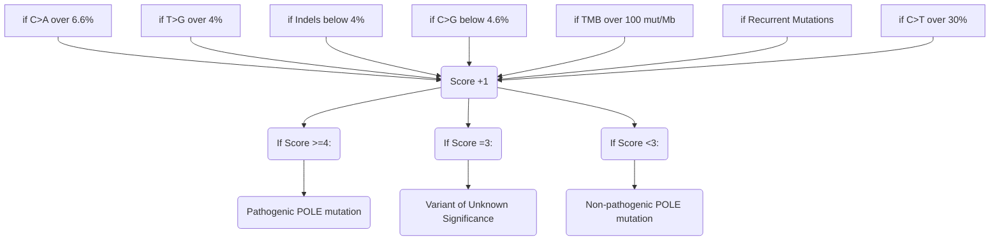

# PathoPoleAnalyzer 

PathoPoleAnalyzer is a tool for calculating a pathogenicity score for Pole mutations, inspired by the findings presented in the Castillo's article (Castillo et. all, 2020)  ["Interpretation of somatic POLE mutations in endometrial carcinoma"] (https://pubmed.ncbi.nlm.nih.gov/31829442/). 

The score is an integer ranging from 0 to 6, indicating whether the POLE mutation is pathogenic (Score >=4), of uncertain significance (Score = 3), or non-pathogenic (Score<3),based on the presence of specific genomic alterations.

To calculate this score, PathoPoleAnalyzer evaluates several parameters:
- Tumor Mutational Burden (TMB)
- Presence of recurrent Pole mutations
- Frequency of C>A substitutions
- Frequency of C>G substitutions
- Frequency of T>G substitutions
- Frequency of Indels (insertions and deletions)

## Requires
- python == 3.9
- PyVCF == 0.6.8
- numpy == 1.23.5
- pandas == 1.5.2

## Input 


### Filter vcf
To reduce the time required for the analysis, it is suggested to first filter the vcf file.
This can easily be done with the [vcf_filter.py]([https://gitlab.com/gstep-bioinformatics-core-facility-research/varan-2.0/-/blob/main/vcf_filter.py](https://github.com/bioinformatics-policlinicogemelli/POLE/blob/main/filter_VCF.py)) script.
Use the following command:
>$ python filterVCF.py -i vcfFilePath -o destinationFilteredVcf

### Input Data
PathoPoleAnalyzer requires a VCF file and a TMB value as input.


Use the following command to launch PathoPoleAnalyzer:
>$ python pathopoleanalyzer.py -folder vcfFilePath --TMB TMBvalue
or
>$ python pathopoleanalyzer.py -f vcfFilePath -t TMBvalue

You can save the result of your analysis in a text file, using the option ```-o/--output``` 
>$ pathopoleanalyzer.py -f vcfFilePath -t TMBvalue -o outputFile

## What raises the Score?

The conditions for which the Score is raised are based on the data available on ["Interpretation of somatic POLE mutations in endometrial carcinoma"](https://pubmed.ncbi.nlm.nih.gov/31829442/)(Castillo et. all, 2020).
Takin into consideration the different size of the exome of the FPG500 input data featured in our study, the threshold the allowed a raise of the score were modified with a conversione via Median of Medians technique-.
Given a filtered VCF file, the requirement to find a POLE mutation are:

	C>A substitutions > 6.6%, 
	T>G substitutions > 4%, 
	C>G substitutions < 4.6%, 
	Indels < 4%, 
	TMB > 100 mut/Mb.
	Presence of Recurrent Mutations


<div class="center">

  




## What is defined as a 'Recurrent Mutation'?

The [over-mentioned Paper](https://pubmed.ncbi.nlm.nih.gov/31829442/)(Table 1 and Table 3 of the Paper) takes in consideration whether POLE mutations were recurrent in ECs within the COSMIC or TCGA databases, as recurrent mutations are more likely to be pathogenic.

As mentioned before, if at least one of these next mutations are featured in the analized VCF, the score will rise by +1.

Below the mutations that are considered recurrent in POLE, along wIth chromosomal position, nucloetide substitution and protein change:

	CHROM: POS			NUCL. SUB.		PROT. CHANGE
	chr12:133253184		c.857C>G		P286R
	chr12:133250289 	c.1231G>T		V411L
	chr12:133253151		c.890C>T  		S297F
	chr12:133249847		c.1376C>T		S459F
	chr12:133249857		c.1366G>C		A456P
	chr12:133252327		c.1100T>C		F367S
	chr12:133250250		c.1270C>A		L424I
	chr12:133253157		c.884T>G		M295R
	chr12:133250213		c.1307C>G		P436R
	chr12:133250189		c.1331T>A		M444K
	chr12:133252325		c.1102G>T		D368Y
 	chr12:133250250		c.1270C>G		L424V
	chr12:133253208		c.833C>T		T278M
 	chr12:133249829		c.1394C>T		A465V
	chr12:133256623      	c.340C>T		R114*
	chr12:133252023		c.1187A>G		E396G
	chr12:133257828		c.100C>T		R34C


</div>
